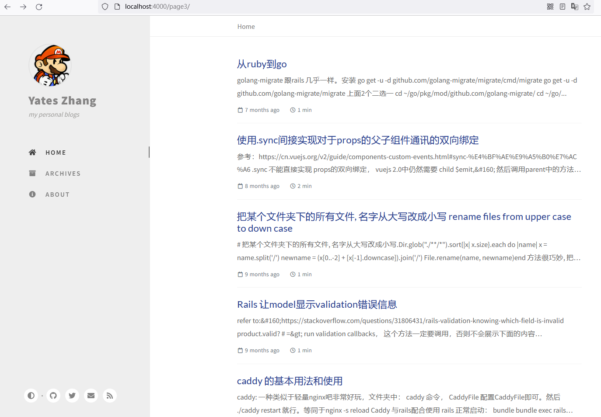

# Yates 的个人博客

https://iamyates.com

使用了Jekyll （部分使用）

## 使用

```
$ ruby -v # 3.x
$ bundle install
$ bundle exec jekyll serve --host 0.0.0.0
```

会生成一个 `_site` 文件夹，上传到远程即可。


## 使用


在文章都写在 `_site`, 命名为 `2022-01-01-title`这样。

```
 2022-03-10-postgres-from-to-column.html
 2022-03-20-ruby-read-remote-uri.html
 2022-04-05-windows-wsl-ubuntu.html
 2022-04-10-windows-disable-touch-screen.html
'2022-04-11-rails - swagger的使用  rswag  与 openapi v3.html'
 2022-04-15-windows-docker-nuxt.html
 2022-05-02-git-cherry-pick.html
'2022-05-03-使用asdf安装erlang, elixir, nodejs ，也可以安装ruby.html'
 2022-05-11-使用fly.io.html
 2022-05-13-omega快捷键.html
 2022-05-24-rails-activejob的使用.html
 2022-05-28-rails-rails6特别神奇的问题cannot-load-such-file-net-smtp-net-imap.html
 2022-06-03-ubuntu重命名标签页-rename-terminal-title.html
 2022-06-08-goerli领取faucet.html
 2022-06-17-在infura上发放contract-erc721.html
 2022-06-23-rails-devise-奇怪的问题-同时使用2个model.html
```

这样 jekyll server 会自动的把前面的日期在title中去掉。


